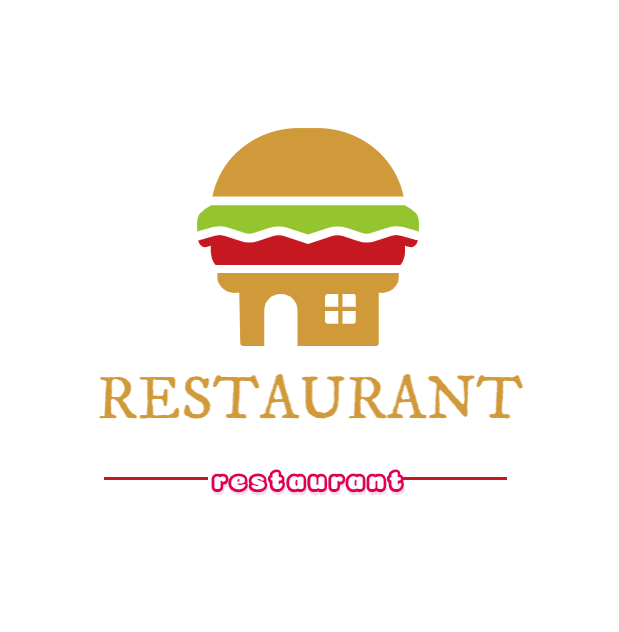

<p align="center">
  
</p>
<p align="center">
  <a href="https://github.com/vuejs/vue">
    
  </a>
  <a href="https://didi.github.io/cube-ui/#/zh-CN">
    
  </a>
  <a href="https://github.com/251205668/restaurant">
    
  </a>
<a href="https://router.vuejs.org/">
    
  </a>
  <a href="https://vuex.vuejs.org/">
    
  </a>
</p>

### A vue.js project which was similar with the take-out restaurant .

```
The project requires a vue-cli4.0 build. This may require uninstalling your previous vue-cli version or you may use the official vue conversion tool for version transfer
```

vue conversion tool:[vue-migration-helper](https://github.com/vuejs/vue-migration-helper)
The project path:[项目地址](http://47.97.180.232:8202/#/)

#### Here are some toogle pictures for the project

###### Home


###### goods


###### comments


###### seller


## Project setup

```
npm install
```

### Compiles and hot-reloads for development

```
npm run serve
```

### Compiles and minifies for production

```
npm run build
```

### Lints and fixes files

```
npm run lint
```

### Customize configuration

See [Configuration Reference](https://cli.vuejs.org/config/).
